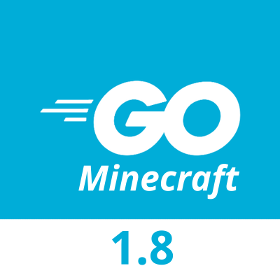

  

  <h3 align="center">Go Server</h3>

  

    Minecraft server 1.8 made in go
     
     
    <a href="https://github.com/MineLC/Go-Server/issues">Report Bug</a>
    ·
    <a href="https://github.com/MineLC/Go-Server/issues">Request Feature</a>
    ·
    <a href="https://github.com/MineLC/Go-Server/pulls">Send a Pull Request</a>
  

  
  <h2>To do:</h2>
  <ul>
    <li>
      <h3>
        <a href="https://www.spigotmc.org/resources/slimeworldmanager.69974/">World System</a>
      </h3>
      
World based on .slime (SlimeWorldManager Format)

    </li>
    <li>
      <h3>
        <a href="https://wiki.vg/Protocol">Many packets features</a>
      </h3>
      
Entities, skins, etc

    </li>
  </ul>

  <h2>Run project</h2>
  <ol>
    <li>Download this project</li>
    <li>Execute "go mod tidy"</li>
    <li>Execute "go run main.go"</li>
  </ol>

  <h2>Build project</h2>
  <ol>
    <li>Download this project</li>
    <li>Execute "go mod tidy"</li>
    <li>Execute "go build"</li>
  </ol>
  <h4>
    <a href="https://go.dev/doc/tutorial/getting-started#write-more">Learn basics of go (compile, run, install, etc)</a>
  </h4>

